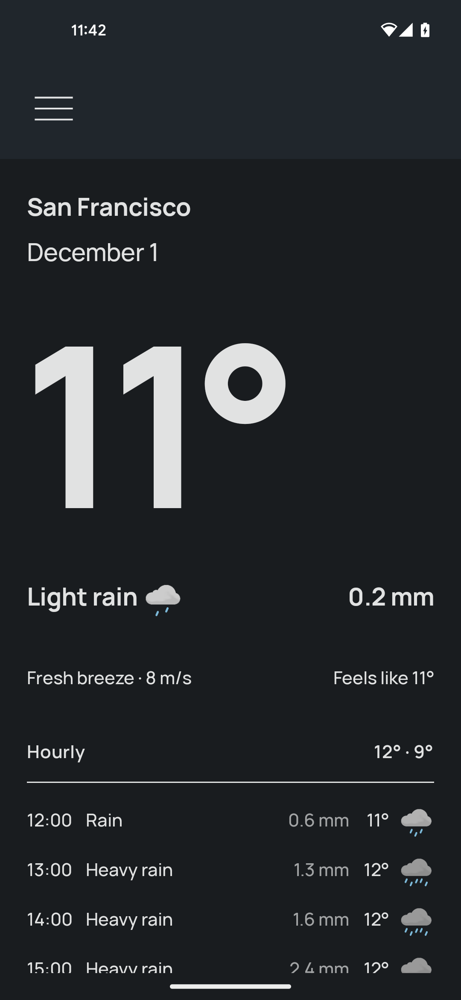
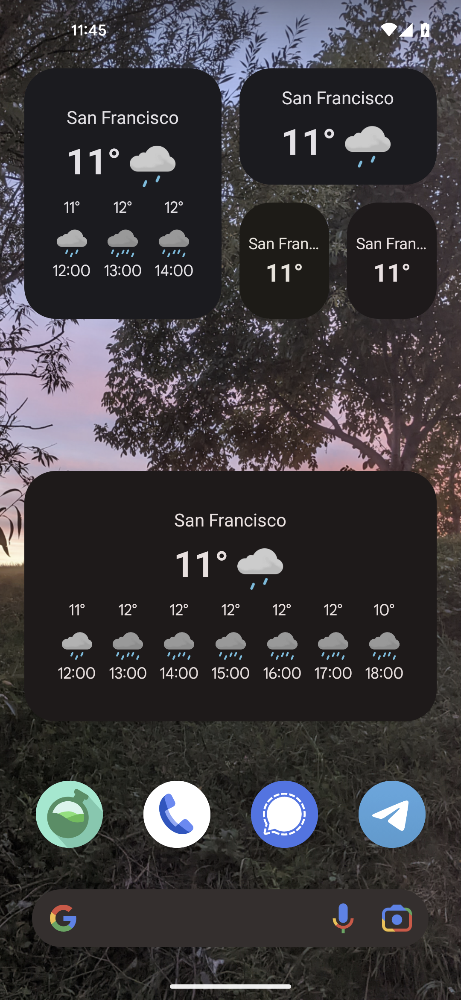
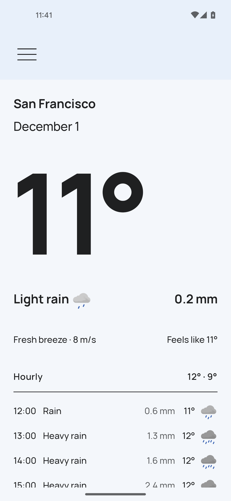
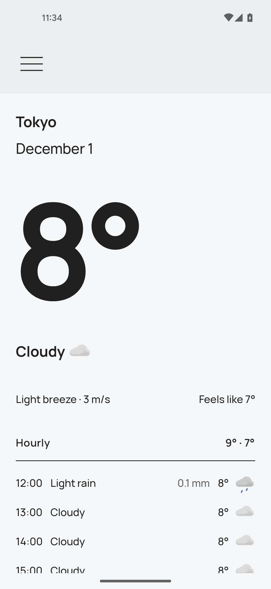

## Screenshots

    
    

    
    

## MVP Project

- MVP project for university work.

## Features
- Multiple weather data providers
- Weather for today and coming days
- App color based on: 
  - Current weather
  - (Android 12+) System color
- Dark and light theme
- Multiple measurement units
- Widgets
- Works offline
- Does not access your location

