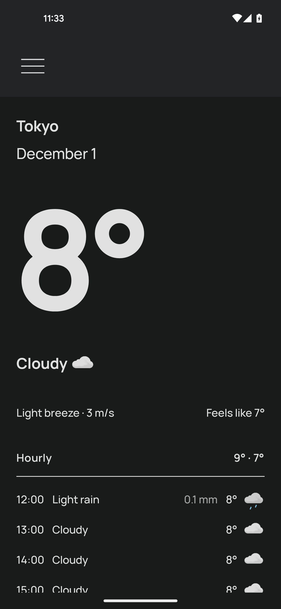
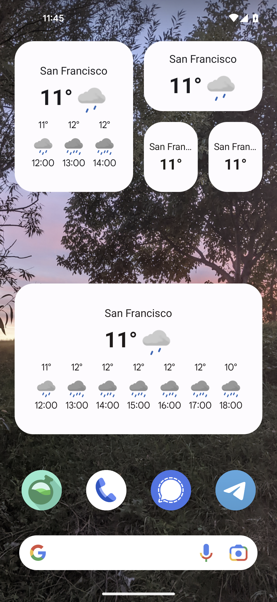

## Screenshots

    
    
    

    
    
    

## Features
- Multiple weather data providers
- Weather for today and coming days
- App color based on: 
  - Current weather
  - (Android 12+) System color
- Dark and light theme
- Multiple measurement units
- Widgets
- Works offline
- Does not access your location

## Translate
You can add and/or edit translations on [Crowdin](https://crowdin.com/project/prognoza). They will be periodically pulled into the project as languages and changes are added.

## Contribute
The app is undergoing a redesign that will bring a bunch of new features including probability of precipitation, wind, UV index, sunrise/sunset times, and more. This requires a significant refactoring of the codebase which will affect most architectural layers. 

Because of this, please do not open PRs for new features now. Only bugfixes will be accepted.

## Donate
If you like Prognoza, you're welcome to send a donation with LiberaPay.

## Credit
Forecast data by [MET Norway](https://www.met.no/en) and [Open-Meteo](https://open-meteo.com/)  
Weather icons by [MET Norway](https://www.met.no/en)  
Geolocation data by [OSM Nominatim](https://nominatim.org/)  
Design inspired by [Neal Hampton](https://dribbble.com/shots/6680361-Dribbble-Daily-UI-37-Weather-2)  
App icon by [Nataša Takač](https://www.instagram.com/art.ofil/)
